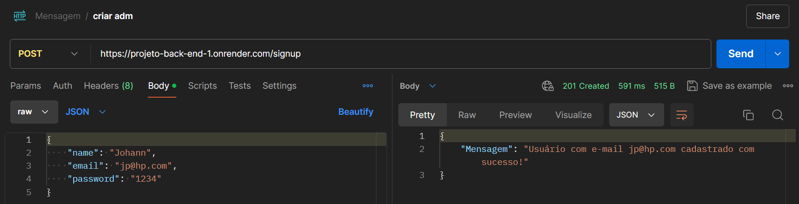
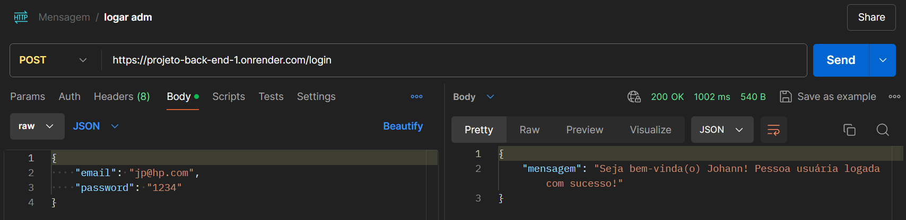
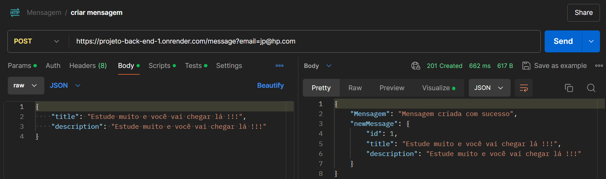
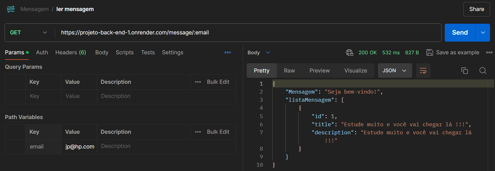
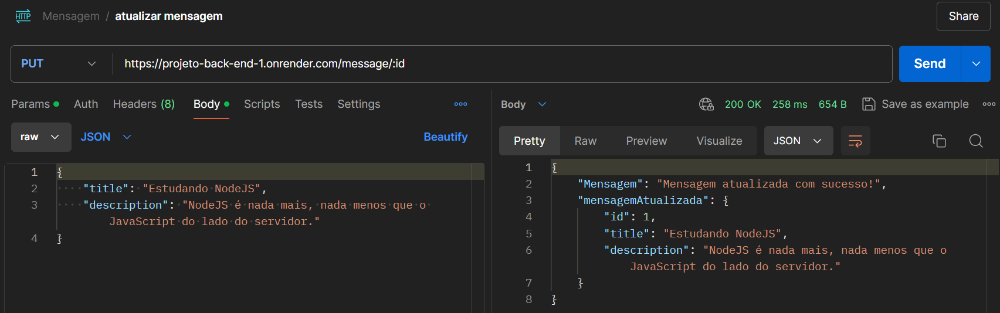
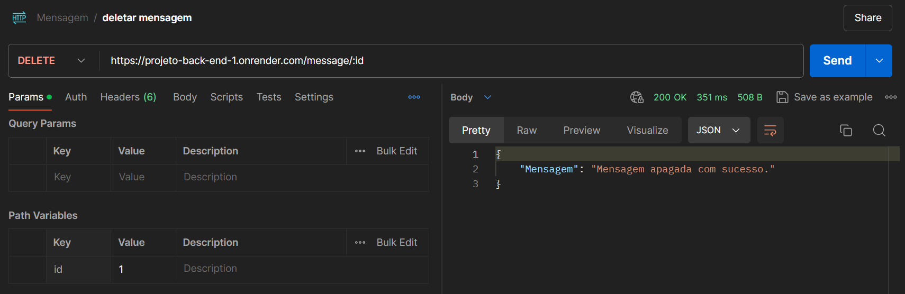

# Projeto-Back-End-1

Este projeto é uma aplicação de servidor web construída com o Node.js e o Express.js. Ele fornece uma plataforma de mensagens onde os usuários podem se cadastrar, fazer login, criar, ler, atualizar e deletar mensagens. Aqui estão os principais recursos:

Início da Aplicação: A aplicação é iniciada na porta 3000 e utiliza o middleware CORS para permitir solicitações de diferentes origens.

Cadastro de Usuário: Os usuários podem se cadastrar fornecendo um nome, e-mail e senha. A senha é criptografada antes de ser armazenada para garantir a segurança dos dados do usuário.

Login do Usuário: Os usuários podem fazer login usando seu e-mail e senha. A senha fornecida é comparada com a senha criptografada armazenada para autenticar o usuário.

Criação de Mensagens: Os usuários autenticados podem criar mensagens. Cada mensagem tem um título e uma descrição.

Leitura de Mensagens: As mensagens podem ser lidas fornecendo o e-mail do usuário. Isso retorna todas as mensagens criadas por esse usuário.

Atualização de Mensagens: As mensagens podem ser atualizadas fornecendo o ID da mensagem e os novos dados da mensagem.

Deleção de Mensagens: As mensagens podem ser deletadas fornecendo o ID da mensagem.

Este projeto utiliza validações de middleware personalizadas para garantir que os dados fornecidos pelos usuários atendam aos requisitos necessários. Além disso, ele fornece respostas de erro claras quando os dados fornecidos são inválidos ou quando ocorrem erros.

Por favor, note que este é um projeto de exemplo e não possui persistência de dados, o que significa que todos os dados serão perdidos quando o servidor for reiniciado. Para um ambiente de produção, seria necessário implementar um banco de dados para armazenar os dados do usuário e das mensagens de forma segura e eficiente.

[Para acessar a documentação do projeto, clique aqui](https://documenter.getpostman.com/view/34269147/2sA3BuW8vm)

## Tecnologias usadas na API:

  

  

  

  

  

  

  

